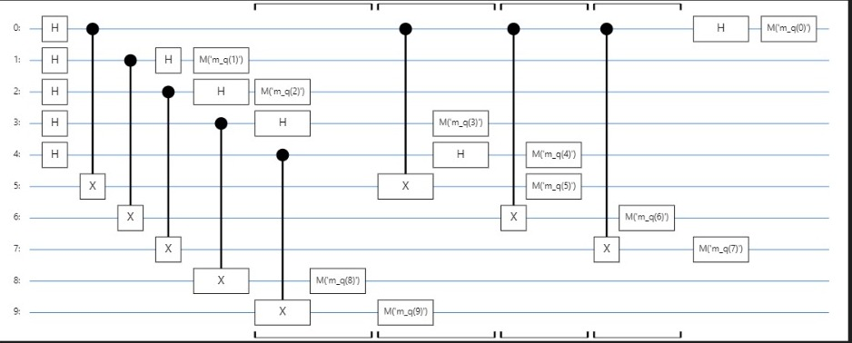

# Simon's Algorithm Implementation



*Figure: Histogram of Measurement Results for Simon's Algorithm*

## Table of Contents

- [Introduction](#introduction)
- [Features](#features)
- [Prerequisites](#prerequisites)
- [Installation](#installation)
- [Usage](#usage)
- [Project Structure](#project-structure)
- [Example](#example)
- [Troubleshooting](#troubleshooting)
- [Contributing](#contributing)
- [License](#license)
- [Acknowledgements](#acknowledgements)

## Introduction

Simon's Algorithm is a quantum algorithm that demonstrates an exponential speedup over classical algorithms for a specific problem. Given a black-box function $\( f: \{0,1\}^n \rightarrow \{0,1\}^n \)$ with the promise that:

- $\( f \)$ is **one-to-one** or **two-to-one**.
- If $\( f \)$ is two-to-one, there exists a non-zero secret string $\( s \)$ such that for every pair $\( x, y \)$, $\( f(x) = f(y) \)$ **if and only if** $\( y = x \oplus s \)$.

The goal is to determine the secret string \( s \).

This project provides a comprehensive implementation of Simon's Algorithm using **Cirq**, Google's Python library for quantum circuits. The implementation is scalable for any number of qubits $\( n \)$ and includes functionalities for:

- Dynamically generating the oracle based on a secret string $\( s \)$.
- Simulating the quantum circuit.
- Extracting the secret string $\( s \)$ from measurement results.
- Visualizing measurement outcomes.

## Features

- **Dynamic Oracle Creation:** Automatically generates the oracle based on a randomly generated secret string $\( s \)$.
- **Scalability:** Handles any number of qubits $\( n \)$ without significant modifications.
- **Visualization:** Provides histograms of measurement results to visualize the algorithm's behavior.
- **Verification:** Includes functions to verify the correctness of the oracle and the extracted secret string.
- **Comprehensive Documentation:** Step-by-step guide and explanations to facilitate understanding and troubleshooting.

## Prerequisites

Before setting up the project, ensure that you have the following installed on your system:

- **Python 3.7 or later:** [Download Python](https://www.python.org/downloads/)
- **Cirq:** Google's Python library for quantum circuits.
- **Matplotlib:** Library for creating static, animated, and interactive visualizations.
- **SymPy:** Python library for symbolic mathematics.
- **Jupyter Notebook:** Web-based interactive computing platform.

## Installation

Follow these steps to set up the development environment for Simon's Algorithm in Cirq.

### 1. Clone the Repository

```bash
git clone https://github.com/your-username/simons-algorithm-cirq.git
cd simons-algorithm-cirq
```

### 2. Create a Virtual Environment (Recommended)

Creating a virtual environment helps manage dependencies and avoid conflicts.

```bash
# Create a virtual environment named 'env'
python -m venv env

# Activate the virtual environment

# On Windows:
env\Scripts\activate

# On Unix/Linux/macOS:
source env/bin/activate
```

### 3. Upgrade pip

Ensure that `pip` is up to date.

```bash
pip install --upgrade pip
```

### 4. Install Required Packages

Install all necessary Python packages using `pip`.

```bash
pip install cirq matplotlib sympy
```

### 5. Install Jupyter Notebook

If you don't have Jupyter Notebook installed, install it using `pip`.

```bash
pip install notebook
```

### 6. Verify Installation

Run the following Python commands to ensure everything is installed correctly.

```python
import cirq
import matplotlib
import sympy

print("Cirq version:", cirq.__version__)
print("Matplotlib version:", matplotlib.__version__)
print("SymPy version:", sympy.__version__)
```

**Expected Output:**

```
Cirq version: X.X.X
Matplotlib version: X.X.X
SymPy version: X.X.X
```

*Note: Replace `X.X.X` with the actual version numbers.*

## Usage

1. **Launch Jupyter Notebook**

   Navigate to the project directory and launch Jupyter Notebook.

   ```bash
   jupyter notebook
   ```

2. **Open the Notebook**

   Open the `simons_algorithm_cirq.ipynb` notebook from the Jupyter interface.

3. **Run the Notebook Cells**

   Execute each cell sequentially. The notebook includes:

   - Functions to generate the secret string $\( s \)$.
   - Oracle creation based on $\( s \)$.
   - Construction and simulation of the quantum circuit.
   - Extraction of $\( s \)$ from measurement results.
   - Visualization of measurement outcomes.

4. **View Results**

   After running all cells, you should see:

   - The quantum circuit diagram.
   - Simulation results.
   - A histogram of measurement results.
   - The extracted secret string $\( s \)$ with a verification message.

## Project Structure

```
simons-algorithm-cirq/
├── simons_algorithm_cirq.ipynb
├── README.md
├── requirements.txt
└── LICENSE
```

- **simons_algorithm_cirq.ipynb:** Jupyter Notebook containing the implementation of Simon's Algorithm.
- **README.md:** This documentation file.
- **requirements.txt:** (Optional) List of Python packages required.
- **LICENSE:** (Optional) Licensing information.

## Example

Here's a brief overview of how Simon's Algorithm works in this implementation:

1. **Secret String Generation:**

   ```python
   s = generate_secret_string(n=4)
   print(f"Secret string s: {''.join(map(str, s))}")
   ```

   *Output:*

   ```
   Secret string s: 1010
   ```

2. **Quantum Circuit Construction:**

   ```python
   circuit = simons_algorithm_circuit(n=4, s=s)
   display_circuit(circuit)
   ```

   *Output:*

   - A figure displaying the qubits and the applied gates.

3. **Simulation and Measurement:**

   ```python
   result = run_simulation(circuit, repetitions=8192)
   plot_histogram_custom(result, n=4, title="Simon's Algorithm Measurement Results")
   ```

   *Output:*

   - A histogram displaying peaks for valid measurement outcomes that satisfy $\( y \cdot s = 0 \)$.

4. **Secret Extraction:**

   ```python
   counts = result.multi_measurement_histogram(keys=[f"m_{qubit}" for qubit in range(n)])
   counts_str = { ''.join(map(str, key)): value for key, value in counts.items() }
   extracted_s = extract_secret_string(counts_str, n=4, s=s)
   print(f"\nExtracted Secret String s: {''.join(map(str, extracted_s)) if extracted_s else 'None'}")
   ```

   *Output:*

   ```
   Extracted Secret String s: 1010
   Success! The extracted secret string matches the original.
   ```

## Troubleshooting

If you encounter issues while running the notebook, consider the following steps:

### 1. **No Output or Empty Cells**

- **Issue:** Cells are not producing any output.
- **Solution:** Ensure that you have executed all preceding cells in order. Restart the kernel and run all cells again.

### 2. **Incorrect Secret Extraction**

- **Issue:** The extracted secret string \( s \) does not match the original.
- **Possible Causes:**
  - Incorrect oracle implementation.
  - Insufficient number of measurement shots.
  - Misinterpretation of measurement results.
- **Solutions:**
  - **Verify Oracle:** Ensure that the CNOT gates are correctly applied based on $\( s \)$.
  - **Increase Shots:** Increase the number of simulation runs (`shots`) to collect more data.
  - **Check Extraction Function:** Ensure that the extraction function correctly processes the measurement results.

### 3. **Error Messages Related to Cirq or Other Libraries**

- **Issue:** Errors during import or execution related to `cirq`, `matplotlib`, or `sympy`.
- **Solution:** Ensure all required packages are installed and up to date. You can reinstall them using `pip`:

  ```bash
  pip install --upgrade cirq matplotlib sympy
  ```

### 4. **Incorrect Histogram Display**

- **Issue:** The histogram does not display expected peaks.
- **Possible Causes:**
  - Oracle does not correctly implement \( f(x) = f(x \oplus s) \).
  - Measurement keys do not correspond to the correct qubits.
- **Solutions:**
  - **Double-Check Oracle:** Review the oracle creation function to ensure correctness.
  - **Verify Measurement Keys:** Ensure that only input qubits are being measured for extracting \( s \).

### 5. **Visualization Issues**

- **Issue:** Histogram or circuit diagrams do not render correctly.
- **Solutions:**
  - Ensure that `matplotlib` is properly installed.
  - In Jupyter Notebook, use `%matplotlib inline` at the beginning to enable inline plotting.

    ```python
    %matplotlib inline
    ```

## Contributing

Contributions are welcome! If you find any issues or have suggestions for improvements, feel free to open an issue or submit a pull request.

1. **Fork the Repository**
2. **Create a Feature Branch**

   ```bash
   git checkout -b feature/YourFeature
   ```

3. **Commit Your Changes**

   ```bash
   git commit -m "Add Your Feature"
   ```

4. **Push to the Branch**

   ```bash
   git push origin feature/YourFeature
   ```

5. **Open a Pull Request**

## License

This project is licensed under the [MIT License](LICENSE).

## Acknowledgements

- [Cirq Documentation](https://quantumai.google/cirq)
- [SymPy Documentation](https://docs.sympy.org/)
- [Matplotlib Documentation](https://matplotlib.org/stable/contents.html)
- Inspired by quantum computing research and educational resources.

---
```
